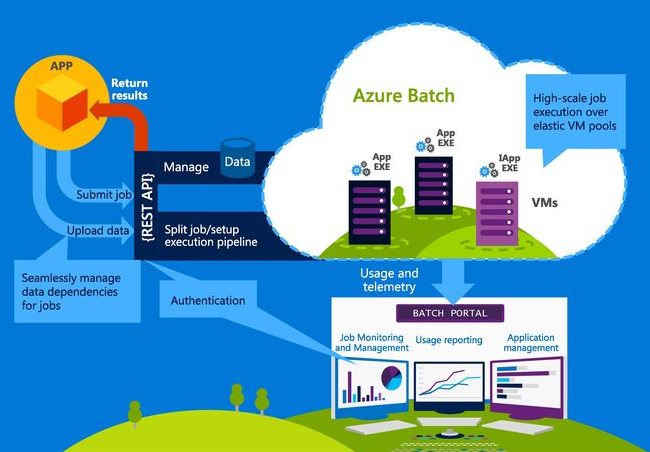

# High Performance Compute POC on Microsoft Azure  #

## Overview ##

The objective of this POC is to demonstrate for the Department of Genome Science at the Australian National University a deployment pattern in Azure for a Genomics research applications (Snakemake) that require High Performance Computing and also include: 

- Simplified provisioning of Open Source Applications (Azure Docker Containers) 
- Ability to dynamically assign resources (Azure Batch) 
- Management tools to manage jobs (Azure Batch Labs) 
- High Fidelity Rendering and Virtualised Desktop (GPU Virtual Machine and Teradici client) 
- Allocation and Management of Spend (Resource Groups, Tagging and Azure Dev Test Labs) 
 

## Objectives ##

1. [Deploy sample Snakemake Pipeline](#sample-snakemake-pipeline) 

Using a sample pipeline and list of utilities provided by the Department of Genome Science deploy a Snakemake application in Azure which processes data using Azure Batch.

2. [Deploy Data Science Virtual Machine ](#deploy-deploy-vw)

Deploy a Data Science Virtual Machine (including R-Studio) with equivalent resources to the existing high-powered workstation with a number of pre-installed utilities such as BioConductor.  Install the Teradici agent to allow remote visualisation of the Virtual Machine.  

3. [Deploy remote visualisation](#deploy-remote-visualisation)  

Deploy a GPU machine, install VMD and install the Teradici agent to allow remote visualisation of complex rendering tasks 

4. [Configure management tools](#configure-management-tools) 

Install and configure Azure Dev-Test Labs, Azure Batch Labs, and demonstrate use of Resource Groups and Tagging. 

5. [Configure Data Sharing scenario](#configure-sharing) 

Set up example of ability to share Data and R/Shiny Applications 

## Azure Batch High Level Architectural  Overview ###

_Azure Batch Overview_

[**Azure Batch**](https://azure.microsoft.com/en-us/services/batch/) is a service that enables you to run batch processes on high-performance computing (HPC) clusters composed of Azure virtual machines (VMs). Batch processes are ideal for handling computationally intensive tasks that can run unattended such as photorealistic rendering and computational fluid dynamics. Azure Batch uses [VM scale sets](https://docs.microsoft.com/en-us/azure/virtual-machine-scale-sets/virtual-machine-scale-sets-overview) to scale up and down and to prevent you from paying for VMs that aren't being used. It also supports autoscaling, which, if enabled, allows Batch to scale up as needed to handle massively complex workloads.

Azure Batch involves three important concepts: **storage**, **pools**, and **jobs**. Storage is implemented through Azure Storage, and is where data input and output are stored. Pools are composed of compute nodes. Each pool has one or more VMs, and each VM has one or more CPUs. Jobs contain the scripts that process the information in storage and write the results back out to storage. Jobs themselves are composed of one or more tasks. Tasks can be run one at a time or in parallel.

**[Batch Shipyard](https://github.com/Azure/batch-shipyard)** is an open-source toolkit that allows Dockerized workloads to be deployed to Azure Batch compute pools. Dockerized workloads use Docker containers rather than VMs. (Containers are hosted in VMs but typically require fewer VMs because one VM can host multiple container instances.) Containers start faster and use fewer resources than VMs and are generally more cost-efficient. For more information, see https://docs.microsoft.com/en-us/azure/virtual-machines/windows/containers.

_Azure Batch Architecture_

The workflow for using Batch Shipyard with Azure Batch is pictured below. After creating a Batch account and configuring Batch Shipyard to use it, you upload input files to storage and use Batch Shipyard to create Batch pools. Then you use Batch Shipyard to create and run jobs against those pools. The jobs themselves use tasks to read data from storage, process it, and write the results back to storage.

_Azure Batch Shipyard workflow_

Low-priority VMs in Batch

Low-priority VMs are available for a much lower price than normal VMs and can significantly reduce the costs of running certain workloads, or allow much more work to be performed at a greater scale for the same cost. However, low-priority VMs do have different characteristics and are only suitable for certain types of applications and workloads. Low-priority VMs are allocated from surplus capacity and therefore availability varies—at times VMs may not be available to allocate, and allocated VMs may occasionally be pre-empted by higher-priority allocations. The availability SLA for normal VMs therefore does not apply to low-priority VMs.

## Pool Sizing for different rule requirements ##

The VM size for each pool in Azure Batch can be tailored to match the requirements for each compute workload. The VM's available on Azure Batch vary in size and price. Charges are calculated on the compute time spent on executing jobs. The pricing for each VM type is detailed in the Azure Batch [**Pricing**](https://azure.microsoft.com/en-us/pricing/details/batch/) list.

| VM Type | Sizing | Description |
|---|---|---|
| General purpose	| DSv2, Dv2, DS, D, Av2, A0-7	| Balanced CPU-to-memory ratio. Ideal for testing and development, small to medium databases, and low to medium traffic web servers. |
| Compute optimized	| Fs, F	| High CPU-to-memory ratio. Good for medium traffic web servers, network appliances, batch processes, and application servers. |
| Memory optimized	| M, GS, G, DSv2, DS, Dv2, D	| High memory-to-core ratio. Great for relational database servers, medium to large caches, and in-memory analytics. |
| Storage optimized	| Ls	| High disk throughput and IO. Ideal for Big Data, SQL, and NoSQL databases. |
| GPU	| NV, NC	| Specialized virtual machines targeted for heavy graphic rendering and video editing. Available with single or multiple GPUs. |
| High performance compute	| H, A8-11	| Our fastest and most powerful CPU virtual machines with optional high-throughput network interfaces (RDMA). |

The full VM list and detailed specification can be found on Azure: 

https://docs.microsoft.com/en-us/azure/virtual-machines/windows/sizes

BizData has created a [**PowerBI**](https://app.powerbi.com/view?r=eyJrIjoiZmU2MWQzZmMtMmZmMy00ZjMwLWFmYTktZWUyNDgwOGIwOGUxIiwidCI6Ijg0ODkyYTJmLTY0OWQtNGY4Yi05ZDdkLWY0NTBlNWQ5Y2FkNSIsImMiOjEwfQ%3D%3D) calculator to assist with calculating the cost and choice of pool sizing.

## Sample Snakemake Pipeline ##

### Brief Overview of Snakemake ###

[**Snakemake**](https://snakemake.readthedocs.io/en/stable/) is an MIT-licensed workflow management system that aims to reduce the complexity of creating workflows by providing a fast and comfortable execution environment, together with a clean and modern specification language in python style. Snakemake workflows are essentially Python scripts extended by declarative code to define rules. Rules describe how to create output files from input files.

Snakemake Example rule step:

~~~~
rule all:
    input:
         QC_trim +
         QC_raw +
         QUANT_feat ...

rule adpt_trimming:
    input:
        R1 = lambda wildcards: config["SampleList"][wildcards.samples]["R1"],
        R2 = lambda wildcards: config["SampleList"][wildcards.samples]["R2"]
    output:
        R1 = config["BASE"] + config["TRIM"] + "/{samples}_t1.fastq.gz",
        R2 = config["BASE"] + config["TRIM"] + "/{samples}_t2.fastq.gz"

    shell:
        """ 
        {params.AdapterRemoval} --file1 {input.R1} --file2 {input.R2} \
        --output1 {output.R1} --output2 {output.R2} \
        --threads 2 --gzip --basename {params.name} --trimqualities --trimns \
        --minquality {params.min_qual} --minlength {params.min_len}
        """ 
~~~~

Typically workflows are executed on a single machine and can utilise only the available resources only on that machine ie. fixed to machine Snakemake is running on.

### Objectives ###

1. To execute an example research Snakemake workflow running on Azure Batch using Batch-Shipyard to manage the pools, jobs and tasks.

2. Use of a custom Docker image stored in a private Azure Container Registry. The Docker image contains the required tools to be used in the workflow.

3. Usage of a shared Azure file clustered storage system to manage inputs/outputs and the Snakemake workflow control files.

### Snakemake on Azure Batch ###

The sample Snakemake is sourced from the Department of Genome Science GitHub repository and involves several types of tool analysis of RNA-Seq and ChIP-Seq sequence data. Each step outputs analysis of the specified data based on the tools used. The data used in the example was sourced from the ANU research respositories:

RNA-seq of TGF-beta and knockdown of histone variant H2A.Z induced EMT in MDCK cells.

RNA-Seq
https://www.ebi.ac.uk/ena/data/view/PRJEB20155

Epigenomic changes associated with TGF-beta induced EMT in MDCK cells.

ChIP-Seq
https://www.ebi.ac.uk/ena/data/view/PRJEB20256

The original Snakemake project can be found at the Department of Genome Science GitHub reference: 

https://github.com/JCSMR-Tremethick-Lab/H2AZ_EMT/tree/azure_migration

The tools used in the sample were added to a custom Docker image and stored in an Azure Container Registry Account. For a full description on how the Docker container was built see the [Sample Snakemake Pipeline](docs/snakemake.md) section.

### Running the Snakemake sample on Azure Batch ###

#### Batch Architecture ####

A standard Azure VM (ubuntu Linux) is used as the 'control' node to run the Snakemake workflows and has Batch-Shipyard installed. Batch-Shipard is used to communicate with Azure Batch to setup pools and to run jobs. A shared file system utilising Azure Blob Storage is mounted on the control node and is shared with the Azure Batch compute nodes. Pools are configured to use the Docker container to execute the workflow.

_Architecture Overview_

#### Running the sample ####

SSH to the Server: hpcanuvm.australiasoutheast.cloudapp.azure.com

Start the Snakemake Azure Batch Pool:

~~~~
$SHIPYARD/shipyard pool add --configdir $FILESHARE/azurebatch
~~~~

Run Snakemake Job:

~~~~
$SHIPYARD/shipyard jobs add --configdir $FILESHARE/azurebatch -v --tail stderr.txt
~~~~

Example Snakemake output streamed to the control node:

For a detailed explanation of the full workflow and setup configuration open the [Sample Snakemake Pipeline](docs/snakemake.md).

## Deploy Remote Visualisation ##

VMD is a molecular visualization program for displaying, animating, and analysing large biomolecular systems using 3-D graphics and built-in scripting. For this component of the POC a standard size GPU machine (Standard_NV6) was used with Windows server 2016 installed. The Teradici graphics agent is installed to allow high fidelity rendering of rendering tasks in VMD.

Other available GPU machines in Azure include:

|Size|vCPU|Memory: GiB|(SSD) GiB|GPU| 
|---|---|---|---|---|
|Standard_NV6|6|56|380|1|	
|Standard_NV12|12|112|680|2|	
|Standard_NV24|24|224|1440|4|

https://www.teradici.com/what-is-pcoip

"PC-over-IP (PCoIP) technology delivers a secure, high-definition and highly responsive computing experience.

PCoIP technology uses advanced display compression to provide end users with cloud-based virtual machines as a convenient alternative to local computers. This virtual workspace architecture compresses, encrypts and transmits only pixels to a broad range of software clients, mobile clients and stateless PCoIP Zero Clients, providing a highly secure enterprise environment.

From a user’s perspective, there is no difference between working with a local computer loaded with software and an endpoint receiving a streamed pixel representation from a central computer."

To access the VMD VM first the Teradici Graphics client needs to be installed:

Installation of the Teradici client: https://techsupport.teradici.com/link/portal/15134/15164/Article/3110/

Download the required client and install locally.

Access the VMD VM:

1. Start the uoahpcvmd VM from the Azure Portal
2. Open the Teradici PCoIP client and connect to uoahpcvmd.westus2.cloudapp.azure.com (user: hpcadmin password: XXX)
3. Start VMD from the task bar and open one of the standard demos.

## Configure Management Tools ##

Install and configure Azure Dev-Test Labs, Azure Batch Labs, and demonstrate use of Resource Groups and Tagging. 

### Resource Tagging ###

Tags can be applied to Azure resources to logically organize them by categories. Each tag consists of a name and a value. For example, you can apply the name "HPC Usage" and the value "Snakemake" to all the resources used in the Snakemake sample. Without this tag there can be difficulty identifying what a resource is used for. Names and values can be defined that make the most sense for organizing your subscription.

After you apply tags, you can retrieve all the resources in your subscription with that tag name and value. Tags enable you to retrieve related resources that reside in different resource groups. This approach is helpful when you need to organize resources for billing or management.

Resources can be tagged from the 'All Resources' list to allow the 'bulk' application of tags:

Individual resources can also be tagged:

Once resources are tagged they can be filtered to show 'Costs by Tag':

 

When setting up Resources they can be put into a Resource Group to allow easy access and visibility when investigating billing information:

The Summary Dashboard can be used to display the cost summary an expected spend rate for the month. This allows Azure Admins to check visibility on the current spent rate in the Azure Subscription:
 
 

### Azure Batch Labs ###

Batch Labs is a client tool to help create, debug and monitor Azure Batch Applications. All of the available pools and jobs are visible in a dashboard framework and allows the easy assessment and management your Azure Batch accounts. It also includes experimental features such as Batch Templates in the aim to improve the Batch experience. 

To install Batch labs download the latest version from:

https://azure.github.io/BatchLabs/

Visibility across pools and allocated cores:

Find anomalies in job run times vs expected run times:

### Dev test labs ###

Azure DevTest Labs is a useful resource when short term VM environments are needed for 'dev' or 'test' environments. They can be reproduced quickly and managed by using cost-saving policies.

DevTest labs could be utilised when environments are needed for a short period of time eg: coursework related to a specific Genomics toolset to allow students to run the tools. The DevTest labs could be allocated for the specific days required and then de-allocated to save on costs for the resources.

For more information on DevTest labs see the online documentation at the Microsoft Azure DevTest labs site:

https://azure.microsoft.com/en-gb/services/devtest-lab/

### Automation ###

Azure Automation delivers a cloud-based automation and configuration service that provides consistent management across your Azure and non-Azure environments. It consists of process automation, update management, and configuration features. Azure Automation provides complete control during deployment, operations, and decommissioning of workloads and resources. For more information see the Microsoft documentation at:

https://azure.microsoft.com/en-au/services/automation/

For the POC and example runbook was built to show the stopping of vm’s on schedule:

To view the runbook open the 'hpcanudmin' resource group and select the automation account, then 'Run Books' and 'Stop-Start-AzureVM':

## Configure Data Sharing scenario ##

Placeholder from Ben

1.	Install BI Portal into your Azure subscription, following the BI Portal Installation Guide
2.	Spin up an Azure Web App in the same subscription and publish the Genomics API app.
3.	(Set up security with Azure AD to this app) – not done yet
4.	(In BI Portal) 
a.	Configure an Asset Type for Blobs uploaded via the app. Save the Asset type and subtype names.
b.	Create a Tile Layout for the app. Add a tile and orient it how it should be displayed.
c.	Edit the tile. Copy the HTML for the app template into the code editor for the tile.
d.	Configure the  BlobLoader initialising block:
i.	apiUrl: the base url to the azure web app above
ii.	assetType: the asset type name specified above
iii.	assetSubType: as above.
e.	Return to View Mode and refresh the page. The App should be ready to go.

Additionally:
5.	Configure an Asset Types for Shiny Apps. (You may have multiple sub types)
6.	Register a Shiny App from the Register-BI-Asset screen (see cog in top right hand corner)

Using the app is a matter of using the uploader to select the documents and pressing “Upload”. You will need to wait until you get a “Submit Succeeded” or “Submit Failed” message before the files have been uploaded. The ‘pacer.js’ progress bar (the yellow bar that obscures the page in all our Luna themed apps) doesn’t necessarily correlate to all the calls being made, especially if there is a chunked blob being uploaded. By this I mean that the bar will disappear and return the user to the page before all uploads have been done. This will need to be prettied up in the future. 

## Additional References ##

https://github.com/Azure/batch-shipyard

https://app.powerbi.com/view?r=eyJrIjoiZmU2MWQzZmMtMmZmMy00ZjMwLWFmYTktZWUyNDgwOGIwOGUxIiwidCI6Ijg0ODkyYTJmLTY0OWQtNGY4Yi05ZDdkLWY0NTBlNWQ5Y2FkNSIsImMiOjEwfQ%3D%3D

---
Copyright 2018 BizData. All rights reserved. Except where otherwise noted, these materials are licensed under the terms of the Apache License, Version 2.0. You may use it according to the license as is most appropriate for your project on a case-by-case basis. The terms of this license can be found in http://www.apache.org/licenses/LICENSE-2.0.
