[Home](../README.md) 

<a name="Setup"></a>
# Control Node Installation Guide #

The control node is small VM used to start up Azure Batch pools and jobs. The setup is generic and can be tailored to meet the needs of the researcher’s requirements. Once a VM has been configured it can be 'generalised' and then used as a template for future VM setups. See the Microsoft documentation on generalising VMs at:

https://docs.microsoft.com/en-us/azure/virtual-machines/windows/capture-image-resource


<a name="SetupPrerequisites"></a>
### Prerequisites ###

- An active Microsoft Azure subscription. 

<a name="ServicesRequired"></a>
### Services Required ###

The 4 Azure Services required are a [Virtual Machine](#SetupVM), [Azure File Share](#SetupFile), [Azure Batch Account](#SetupAzureBatch) and optionally an [Azure Container Registry ](#SetupShipyard) 


<a id="SetupVM"/></a>
##  Create an Azure VM ##

An Azure Virtual Machine (VM) is used as the 'control node' for running the Azure Batch Jobs.

1. Login to [Azure Portal](https://portal.azure.com). If you are asked to log in, do so using your Microsoft account.
2. Click the New button found on the upper left-hand corner of the Azure portal.
3. Select Compute, then filter in the Search for 'ubuntu'. Select Ubuntu Server 16.04 LTS, and ensure that Resource Manager is the selected deployment model. Click the Create button.

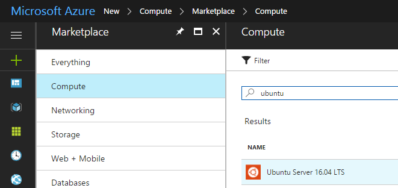


4. Enter the virtual machine information. For Authentication type, select Password and make sure the Resource Group used here is same one for all of the Azure 
services in the next steps. If you don't have a Resource Group setup click on the 'Add New'. When the details are complete, click Ok

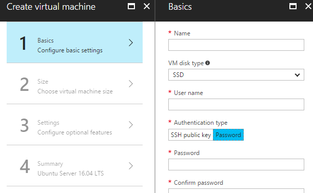


5. Select a size for the VM. To see more sizes, select View all or change the Supported disk type filter. The VM does not need a high specification as it is only a control node.
The actual compute will be handled by Azure Batch. Changing the 'Supported Disk Type' to HDD will provide some cheaper options eg. A1 Basic or A1 Standard.

6. Complete the next 2 steps in the Azure Wizard by clicking 'Select' for the VM size then OK

7. Once the VM setup is complete we need the IP address to enable us to login to the machine. Copy the IP and save it to a temporary text file.

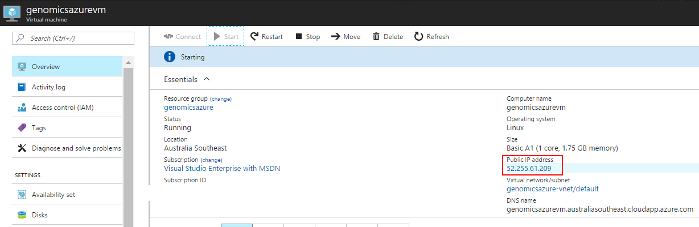


<a id="SetupFile"/></a>
##  Create an Azure Storage Fileshare ##

An Azure Storage fileshare  is used as the central location for the input/output and any control files.

1. Login to [Azure Portal](https://portal.azure.com). If you are asked to log in, do so using your Microsoft account.
2. Click the New button found on the upper left-hand corner of the Azure portal.
3. Select Storage then Storage Account. Click the Create button.

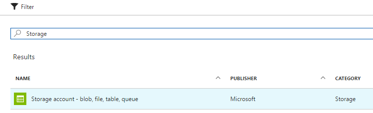

4. Enter the Storage Account information and ensure that Resource Group is same one created for the VM. When the details are complete, click Create

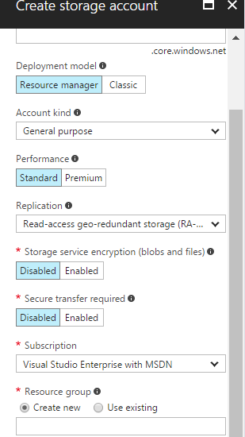

5. Once the Storage Account creation is complete a new fileshare needs to be created. The accesskey also needs to be saved for VM configuration section. Click on Files 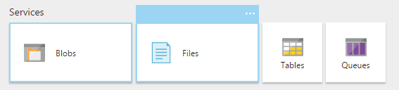 and then 'File Share' 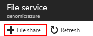

6. Once the File Share has been created click on 'Access Keys'. We will need these to login to the fileshare in a later step. Copy the user and access key into a Temporary
file.

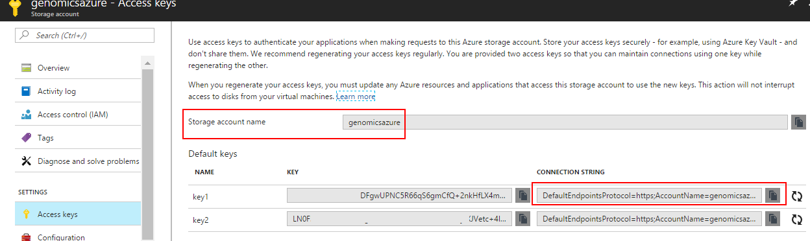

<a id="SetupAzureBatch"/></a>
##  Create an Azure Batch Account ##

[Azure Batch](https://azure.microsoft.com/en-au/services/batch/) is used as the compute engine to execute the batch jobs.

1. Login to [Azure Portal](https://portal.azure.com). If you are asked to log in, do so using your Microsoft account.

2. Click New > Compute > Batch Service.

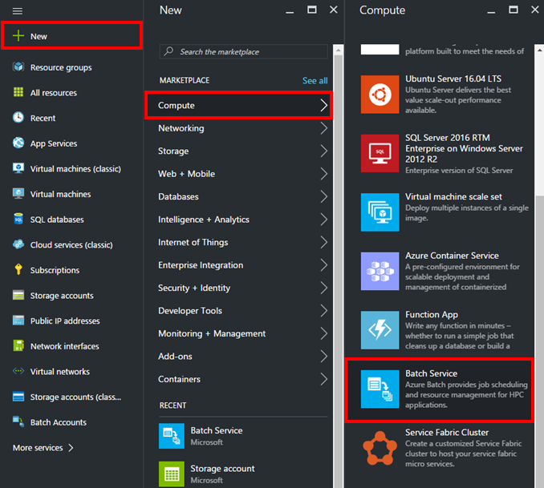

3. The New Batch Account blade is displayed. Enter the required values and make sure you use the Resource Group created for the VM.

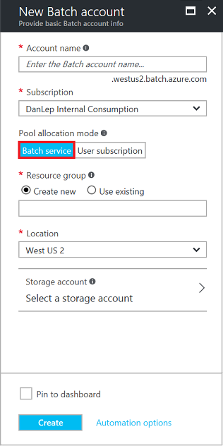

Click Create to create the account.

4. View Batch account properties - We need the Batch account URL to add to the Batch-Shipyard configuration files. Click on overview and copy the URL into a Temporary
file. A Batch account URL has the following format: https://<account_name>.<region>.batch.azure.com

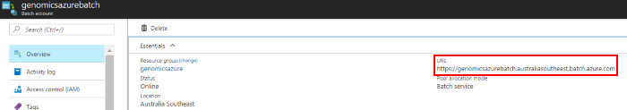

5. Access keys - To authenticate access to your Batch account from Batch-Shipyard we will need the account access key. Click on 'Key's and copy the Primary Access Key into a Temporary file.

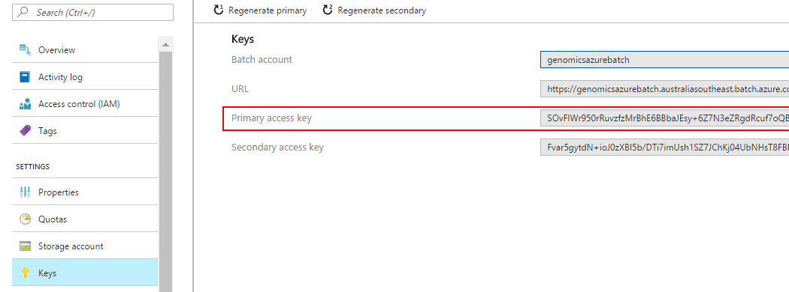


<a id="SetupShipyard"/></a>
##  Install Batch-Shipyard ##

https://github.com/Azure/batch-shipyard/blob/master/docs/01-batch-shipyard-installation.md


For the installation you will install PiPy, the Python package manager, and then use it to install the dependencies for Batch Shipyard. 

1. Begin by launching a terminal. If you're using a desktop version of Linux, the terminal is usually in the Applications menu. It can also be launched by pressing **Ctrl+Alt+F1**. Once the terminal is started, use the following command to install Python, PiPy, and git using apt-get:

	````
	sudo apt-get install python-pip python git
	````

2. Execute the following command to clone Batch Shipyard on the local machine. This will create a folder named "batch-shipyard" and download all the files to that directory.

	````
	git clone https://github.com/Azure/batch-shipyard.git
	````

3. Use a ```cd``` command to change to the "batch-shipyard" folder:

	````
	cd batch-shipyard
	````

4. Use the following command to finish the installation by running the included setup script. The script invokes PiPy to install the dependencies needed by Batch Shipyard.

	````
	./install.sh -e shipyard.venv
	````


<a id="SetupDocker"/></a>
##  Create an Azure Docker Container Hub ##

The following link has a very detailed explanation on setting up an Azure Docker Container: https://blogs.msdn.microsoft.com/uk_faculty_connection/2016/09/23/getting-started-with-docker-and-container-services/

The standard docker deployment and configuration is used in the Azure Docker Containers: https://docs.docker.com/get-started/#setup

## Setup the fileshare ##

Setup the new share filesystem. For this step we install CIFS, create a local folder for the share and then will map it to the Azure Fileshare

~~~~
sudo apt-get install cifs-utils
sudo mkdir /home/hpcadmin/fileshare
~~~~

Mount the Azure File Share. The folder needs to match the one created above and replace the name and key eg: '//yourstorageaccount.file.core.windows.net/fileshare' with your file
share tne the password with your key.

~~~~
sudo mount -t cifs //yourstorageaccount.file.core.windows.net/fileshare /home/hpcadmin/fileshare -o vers=3.0,user=youracountlogin,password=keyfromtheazureportalendningin==,dir_mode=0777,file_mode=0777
~~~~

To make these persistent they need to be added to /etc/fstab

## Setup Environment Variables ##

You can setup environment variables to be used in the execution of the batch shipyard commands:

~~~~
export FILESHARE="/home/hpcadmin/fileshare" 
export SHIPYARD="/home/hpcadmin/batch-shipyard" 
~~~~

To make these persistent they need to be added to /etc/environment 

## Add Desktop Environment (optional) ##

To add a desktop to the control node VM run the following commands:

~~~~
udo apt-get update
sudo apt-get install xfce4
sudo apt-get install xrdp
echo xfce4-session >~/.xsession
sudo service xrdp restart
~~~~

Add a networking rule in the Azure Portal to allow RDP connections:

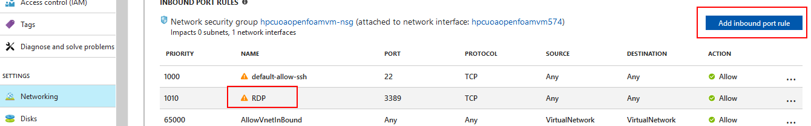

## Add Chrome Browser if the Desktop is installed (optional) ##

If an Internet browser is required install Chrome using these commands:

~~~~
wget -q -O - https://dl-ssl.google.com/linux/linux_signing_key.pub | sudo apt-key add - 
sudo sh -c 'echo "deb http://dl.google.com/linux/chrome/deb/ stable main" >> /etc/apt/sources.list.d/google.list'
sudo apt-get update 
sudo apt-get install google-chrome-stable 
~~~~
