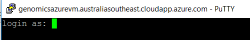

[Home](../README.md) 

## Sample OpenFOAM on Azure Batch ##

### Overview ###

The sample OpenFOAM is sourced from the [*pitzDaily*](https://github.com/OpenFOAM/OpenFOAM-2.3.x/tree/master/tutorials/incompressible/pimpleFoam/pitzDaily) sample.

*Docker container used*

The Docker container used in this sample is from the Azure Batch repository at: alfpark/openfoam:4.0-gcc-openmpi

More details on the configuration of the Docker image can be found at: https://hub.docker.com/r/alfpark/openfoam/

The Batch-shipyard setup are detailed in the [Configuration](#Config) section.

## Login to the VM ##

To execute the sample you will need to login to the example VM server using [PuTTY](http://www.putty.org/) or [OpenSHH](https://www.openssh.com/). RDP can also be used to remote desktop to the VM.

In a Windows command prompt enter:

````
putty hpcuoaopenfoamvm.australiasoutheast.cloudapp.azure.com
````



Login with:
````
User: hpcadmin
Password: <passwordhere>
````

## Running the example ##

Change to the sample folder on the VM

````
cd $FILESHARE/openfoam/pitzDaily
ls -la
````

The folder structure of the example:

````
../azurebatch - contains the Azure Batch-shipyard configuration scripts
constant - mesh file definition
system - control files for the OpenFOAM analysis
hostfile - used by MPI to control the nodes available
````

Firstly we need to setup the Azure Batch pools to run the jobs on. Execute the following command to setup the Azure Batch pools that we 
will need, and wait for the compute nodes to start up.

````
$SHIPYARD/shipyard pool add --configdir $FILESHARE/azurebatch/openfoam
````


The node will be ready when the pool configuration is complete. Once the pool is up and running, Azure Batch is ready to execute jobs. 

To run the OpenFOAM job on Azure Batch start the job using:

~~~~
$SHIPYARD/shipyard jobs add --configdir $FILESHARE/azurebatch/openfoam -v --tail stdout.txt
~~~~


### Viewing the Results ### 

The output of the OpenFOAM can be viewed in ParaView. You will need to RDP to the VM to run ParaView. 


### Final step - Removing the Azure Batch Pools ### 

After the job is complete remove the jobs and pools - enter 'y' when prompted. This removes the resources being used by Azure Batch.

~~~~
$SHIPYARD/shipyard jobs del --configdir $FILESHARE/azurebatch/openfoam  --all-jobs

$SHIPYARD/shipyard pool del --configdir $FILESHARE/azurebatch/openfoam
~~~~

<a name="Config"></a>
## Configuration and how it works ##

### Azure Batch Configuration ###

The Batch-Shipyard configuration files are located in the 'azurebatch' folder.

*config.yaml*

Overall configuration used by all of the jobs/tasks. This specified the shared storage and docker images available to be used in the jobs.

````
batch_shipyard:
  storage_account_settings: mystorageaccount
global_resources:
  docker_images:
  - alfpark/openfoam:4.0-gcc-openmpi
  volumes:
    shared_data_volumes:
      sharedfiles:
        volume_driver: azurefile
        storage_account_settings: mystorageaccount
        azure_file_share_name: openfoam
        container_path: $AZ_BATCH_NODE_SHARED_DIR/gfs
        mount_options:
        - file_mode=0777
        - dir_mode=0777
````

*jobs.yaml*

This is the definition of each job to be run. In this case it uses the Docker image stored in the Azure Batch repository: alfpark/openfoam:4.0-gcc-openmpi

````
job_specifications:
  - id: openfoam
    auto_complete: true
    tasks:
    - docker_image: alfpark/openfoam:4.0-gcc-openmpi
      shared_data_volumes:
      - sharedfiles
      multi_instance:
        num_instances: pool_current_dedicated
      command: $AZ_BATCH_NODE_SHARED_DIR/gfs/run.sh
````

*pools.yaml*

Overall pool configuration. This defines the compute VM size that will be used when running the docker image for jobs.

The VM sizing for the compute is this example is using a basic sized VM 'Standard_D1'. Different sized VM's can be specified based on the required task.

````
pool_specification:
  id: docker-openfoam-tcp1
  vm_configuration:
    platform_image:
      offer: UbuntuServer
      publisher: Canonical
      sku: 16.04-LTS
  vm_count:
    dedicated: 2
    low_priority: 0
  vm_size: Standard_D1
  inter_node_communication_enabled: true
  ssh:
    username: hpcadmin
````

*credentials.yaml*

User and logins needed to connect to the Azure resources.

~~~~
credentials:
  batch:
    account_key: batchkeyendingin==
    account_service_url: https://hpcuoaopenfoambatch.australiasoutheast.batch.azure.com/
  storage:
    mystorageaccount:
      account: hpcuoasnakemake
      account_key: accountkeyendingin==
      endpoint: core.windows.net

~~~~

<a name="Template"></a>
## Template ##

A Template of the configuration files required to setup a new OpenFOAM using Azure Batch.

[OpenFOAM Template](openfoamtemplate.md)

<a name="Installation"></a>
## Installation Guide ##

Full installation guide to setup the control VM and required Azure services to run on Azure Batch

[Control Node Installation Guide](install.md)


