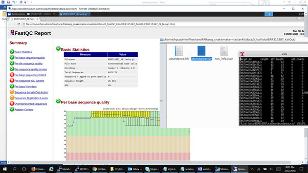

[Home](../README.md) 

## Sample Snakemake on Azure Batch ##

### Overview ###

The sample Snakemake is sourced from the UoA Bioinformatics Hub GitHub repository and involves several types of tool analysis of RNA sequence data. Each step outputs analysis of the specified data based on the tools used. The data used in the example was sourced from the [*EBI*](https://www.ebi.ac.uk/arrayexpress/experiments/E-MTAB-2836/samples/?full=true&s_page=5&s_pagesize=25&s_sortby=col_32&s_sortorder=ascending) archives for E-MTAB-2836: 'RNA-seq of coding RNA from tissue samples of 122 human individuals representing 32 different tissues'. 

The original Snakemake project can be seen at the UoA Bioinformatics GitHub reference: 

https://github.com/UofABioinformaticsHub/RNAseq_snakemake/tree/jimmy_branch

A custom Docker container was built to match the required tools used in the Snakemake workflow and stored in an Azure Container Registry. 

*Docker container used*

Dockerfile for the custom Docker container:

~~~~
FROM ubuntu:16.04
RUN apt-get clean
RUN apt-get update 

 # Install dependencies
RUN apt-get install -y --fix-missing --no-install-recommends \
unzip \
build-essential \
wget \
make \ 
bzip2 \
libncurses5-dev \
zlib1g-dev \ 
libbz2-dev \
software-properties-common \
debconf-utils

 # Add Java support
RUN add-apt-repository ppa:webupd8team/java
RUN apt-get update 
RUN echo "oracle-java8-installer shared/accepted-oracle-license-v1-1 select true" | debconf-set-selections
RUN apt-get install -y oracle-java8-set-default

 # Folder for tools
RUN mkdir /home/apps

 # Add adapterremoval-2.1.7 - build from source
RUN wget --no-check-certificate -O /home/apps/adapterremoval-2.1.7.tar.gz https://github.com/MikkelSchubert/adapterremoval/archive/v2.1.7.tar.gz
RUN cd /home/apps ; tar xvzf adapterremoval-2.1.7.tar.gz ; cd adapterremoval-2.1.7 ; make

 # Add subread-1.6.0 - build from source
RUN wget --no-check-certificate -O /home/apps/subread-1.6.0-source.tar.gz https://nchc.dl.sourceforge.net/project/subread/subread-1.6.0/subread-1.6.0-source.tar.gz
RUN cd /home/apps ; tar zxvf subread-1.6.0-source.tar.gz ; cd subread-1.6.0-source/src ; make -f Makefile.Linux

 # Add stringtie-1.3.3b - use binary version
RUN wget --no-check-certificate -O /home/apps/stringtie-1.3.3b.Linux_x86_64.tar.gz http://ccb.jhu.edu/software/stringtie/dl/stringtie-1.3.3b.Linux_x86_64.tar.gz
RUN cd /home/apps ; tar zxvf stringtie-1.3.3b.Linux_x86_64.tar.gz ; mv stringtie-1.3.3b.Linux_x86_64 stringtie-1.3.3b 

 # Add Salmon-0.9.1 - use binary version
RUN wget --no-check-certificate -O /home/apps/Salmon-0.9.1_linux_x86_64.tar.gz https://github.com/COMBINE-lab/salmon/releases/download/v0.9.1/Salmon-0.9.1_linux_x86_64.tar.gz
RUN cd /home/apps ; tar zxvf Salmon-0.9.1_linux_x86_64.tar.gz ; 

 # Add hisat2-2.1.0 - use binary version
RUN wget --no-check-certificate -O /home/apps/hisat2-2.1.0-Linux_x86_64.zip ftp://ftp.ccb.jhu.edu/pub/infphilo/hisat2/downloads/hisat2-2.1.0-Linux_x86_64.zip
RUN cd /home/apps ; unzip hisat2-2.1.0-Linux_x86_64.zip; 

 # Add sambamba_v0.6.7 - use binary version
RUN mkdir /home/apps/sambamba_v0.6.7
RUN wget --no-check-certificate -O /home/apps/sambamba_v0.6.7/sambamba_v0.6.7_linux.tar.bz2 https://github.com/biod/sambamba/releases/download/v0.6.7/sambamba_v0.6.7_linux.tar.bz2
RUN cd /home/apps/sambamba_v0.6.7 ; tar xvjf sambamba_v0.6.7_linux.tar.bz2

 # Add sambamba_v0.6.7 - use binary version
RUN wget --no-check-certificate -O /home/apps/kallisto_linux-v0.43.1.tar.gz https://github.com/pachterlab/kallisto/releases/download/v0.43.1/kallisto_linux-v0.43.1.tar.gz
RUN cd /home/apps ; tar zxvf kallisto_linux-v0.43.1.tar.gz ; mv kallisto_linux-v0.43.1 kallisto_v0.43.1

 # Add picard 2.17.2
RUN mkdir /home/apps/picard
RUN wget --no-check-certificate -O /home/apps/picard/picard.jar https://github.com/broadinstitute/picard/releases/download/2.17.2/picard.jar

 # Add fastqc 0.11.7
RUN wget --no-check-certificate -O /home/apps/fastqc_v0.11.7.zip https://www.bioinformatics.babraham.ac.uk/projects/fastqc/fastqc_v0.11.7.zip
RUN cd /home/apps ; unzip fastqc_v0.11.7.zip; 

RUN apt-get install -y --fix-missing --no-install-recommends liblzma-dev

 # Add Samtools-1.3.1
RUN wget --no-check-certificate  -O /home/apps/samtools-1.6.tar.bz2 https://github.com/samtools/samtools/releases/download/1.6/samtools-1.6.tar.bz2
RUN cd /home/apps ; bunzip2 samtools-1.6.tar.bz2 ; tar -xvf samtools-1.6.tar ; cd samtools-1.6 ; ./configure ; make ; make install

RUN cd /home/apps ; rm *.tar* ; rm *.zip

RUN apt-get install -y --fix-missing --no-install-recommends snakemake
RUN cd /home/apps/FastQC ; chmod +x fastqc; sed -i 's/-Xmx250m/-Xmx5G/g' /home/apps/FastQC/fastqc

~~~~

The Snakefile and Batch-shipyard setup for the building of the Docker image and deployment to the Azure Container Registry are detailed in the [Configuration](#Config) section.

## Login to the VM ##

To execute the sample you will need to login to the example VM server using [PuTTY](http://www.putty.org/) or [OpenSHH](https://www.openssh.com/). RDP can also be used to remote desktop to the VM.

In a Windows command prompt enter:

````
putty hpcuoasnakemakevm.australiasoutheast.cloudapp.azure.com
````


Login with:
````
User: hpcadmin
Password: <passwordhere>
````

## Running the example ##

Change to the sample folder on the VM

````
cd $FILESHARE/RNAseq_snakemake-masterAll
ls -la
````

The folder structure of the example:

````
azurebatch - contains the Azure Batch-shipyard configuration scripts
data - input data to be processed
jobrunall.sh - shell script used in the Azure Batch job
.snakefile - folder managed by Snakemake (control files)
snakefile.py - the Snakemake workflow file
tsv2yaml.sh - configuration script to generate the config.yaml file
config.yaml - the location of the files and tools needed
cleanup.sh - removes the Snakemake results so a clean run can be performed
````

Firstly we need to setup the Azure Batch pools to run the jobs on. Execute the following command to setup the Azure Batch pools that we 
will need, and wait for the compute nodes to start up.

````
$SHIPYARD/shipyard pool add --configdir $FILESHARE/RNAseq_snakemake-masterAll/azurebatch/rnaseqall
````


The node will be ready when the pool configuration is complete. Once the pool is up and running, Azure Batch is ready to execute jobs. 

The 'cleanup' script removes the Snakemake outputs so a fresh run can be performed. If Snakemake detects that the outputs already exist then it will not run the workflow:

````
./cleanup.sh
````

To run the Snakemake job on Azure Batch start the job using:

~~~~
$SHIPYARD/shipyard jobs add --configdir $FILESHARE/RNAseq_snakemake-masterAll/azurebatch/rnaseqall -v --tail stderr.txt
~~~~


### Viewing the Results ### 

The output of the Snakemake can be view in the data folders. 




### Final step - Removing the Azure Batch Pools ### 

After the job is complete remove the jobs and pools - enter 'y' when prompted. This removes the resources being used by Azure Batch.

~~~~
$SHIPYARD/shipyard jobs del --configdir $FILESHARE/RNAseq_snakemake-masterAll/azurebatch/rnaseqall  --all-jobs

$SHIPYARD/shipyard pool del --configdir $FILESHARE/RNAseq_snakemake-masterAll/azurebatch/rnaseqall
~~~~

<a name="Config"></a>
## Configuration and how it works ##

### Snakemake file ###

Instead of executing the commands locally the batch shipyard job runs the snakemake file on the compute node in the pool. To allow the execution of the snakemake workflow the shell command needs to be modified to 'cd' to the shared folder. The shared folder contains the data and the snakemake control files eg:

~~~~
...
    shell:
         echo "#!/usr/bin/env bash
         cd $FILESHARE/RNAseq_snakemake-master


~~~~

As the snakemake will be running in the Docker image paths to the tools used need to match the ones setup in the Docker image eg: in the tsv2yaml.sh file modify the paths to match the Docker paths.

~~~~
AdapterRemoval: '/home/apps/adapterremoval-2.1.7/build/AdapterRemoval'
featurecounts: '/home/apps/subread-1.6.0-source/bin/featureCounts'
stringtie: '/home/apps/stringtie-1.3.3b/stringtie'
salmon: '/home/apps/Salmon-latest_linux_x86_64/bin/salmon'
hisat2: '/home/apps/hisat2-2.1.0/hisat2'
sambamba: '/home/apps/sambamba_v0.6.7/sambamba'
picard: '/home/apps/picard/picard.jar'
kallisto: '/home/apps/kallisto_v0.43.1/kallisto'
fastqc: '/home/apps/FastQC/fastqc'
~~~~

### Azure Batch Cobfiguration ###

The Batch-Shipyard configuration files are located in the 'azurebatch' folder.

*config.yaml*

Overall configuration used by all of the jobs/tasks. This specified the shared storage and docker images available to be used in the jobs.

````
batch_shipyard:
  storage_account_settings: mystorageaccount
global_resources:
  additional_registries:
    docker:
    - hpcuoadocker.azurecr.io
  docker_images:
  - hpcuoadocker.azurecr.io/rnaseq:latest
  volumes:
    shared_data_volumes:
      sharedfiles:
        volume_driver: azurefile
        storage_account_settings: mystorageaccount
        azure_file_share_name: fileshare
        container_path: /home/hpcadmin/fileshare
        mount_options:
        - file_mode=0777
        - dir_mode=0777
````

*jobs.yaml*

This is the definition of each job to be run. In this case it uses the Docker image we have created: hpcuoadocker.azurecr.io/rnaseq:latest

````
job_specifications:
  - id: rnaseqjoball
    tasks:
    - docker_image: hpcuoadocker.azurecr.io/rnaseq:latest
      shared_data_volumes:
      - sharedfiles
      command: /home/hpcadmin/fileshare/RNAseq_snakemake-masterAll/jobrunall.sh
````

*pools.yaml*

Overall pool configuration. This defines the compute VM size that will be used when running the docker image for jobs.

The VM sizing for the compute is this example is using a basic sized VM 'Standard_D1'. Different sized VM's can be specified based on the required task.

````
pool_specification:
  id: rnaseqpoolall
  vm_configuration:
    platform_image:
      offer: UbuntuServer
      publisher: Canonical
      sku: 16.04-LTS
  vm_count:
    dedicated: 0
    low_priority: 1
  vm_size: Standard_D1
  ssh:
    username: hpcadmin
````

*credentials.yaml*

User and logins needed to connect to the Azure resources.

~~~~
credentials:
  batch:
    account_key: batchkeyendingin==
    account_service_url: https://hpcuoasnakemakebatch.australiasoutheast.batch.azure.com/
  storage:
    mystorageaccount:
      account: hpcuoasnakemake
      account_key: accountkeyendingin==
      endpoint: core.windows.net
  docker_registry:
    hpcuoadocker.azurecr.io:
      username: hpcuoadocker
      password: dockerpassword

~~~~
### Docker Configuration ###

Install Docker on the control node and login:

~~~~
sudo apt install docker.io
sudo docker login hpcuoadocker.azurecr.io   (user and pass from the portal)
~~~~

Build the Docker Container and the push to the Registry:

~~~~
sudo docker build ./ -f Dockerfile -t hpcuoadocker.azurecr.io/rnaseq
sudo docker push hpcuoadocker.azurecr.io/rnaseq
~~~~

Test the container if needed:

~~~~
sudo docker run -it hpcuoadocker.azurecr.io/rnaseq
~~~~

<a name="Template"></a>
## Template ##

A Template of the configuration files required to setup a new Snakemake using Azure Batch.

[Snakemake Template](snakemaketemplate.md)

<a name="Installation"></a>
## Installation Guide ##

Full installation guide to setup the control VM and required Azure services to run on Azure Batch

[Control Node Installation Guide](install.md)


