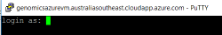
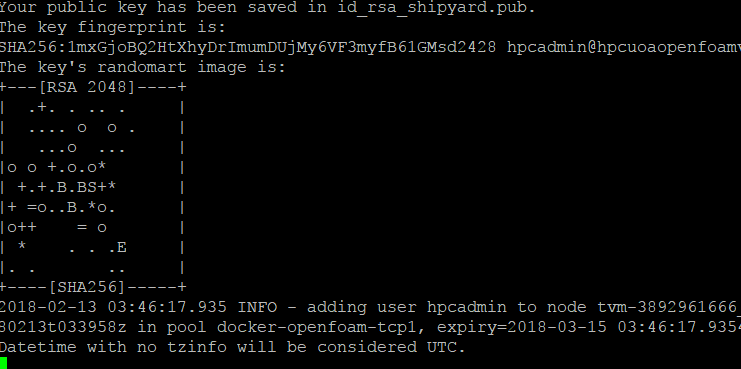

[Home](../README.md) 

## Sample Snakemake on Azure Batch ##

### Overview ###

The sample Snakemake is sourced from the Department of Genome Science GitHub repository and involves several types of tool analysis of RNA-Seq and ChIP-Seq sequence data. Each step outputs analysis of the specified data based on the tools used. The data used in the example was sourced from the ANU research respositories:

RNA-seq of TGF-beta and knockdown of histone variant H2A.Z induced EMT in MDCK cells.

RNA-Seq https://www.ebi.ac.uk/ena/data/view/PRJEB20155

Epigenomic changes associated with TGF-beta induced EMT in MDCK cells.

ChIP-Seq https://www.ebi.ac.uk/ena/data/view/PRJEB20256

The original Snakemake project can be found at the Department of Genome Science GitHub reference:

https://github.com/JCSMR-Tremethick-Lab/H2AZ_EMT/tree/azure_migration

*Docker container used*

Dockerfile for the custom Docker container:

~~~~
FROM ubuntu:16.04
RUN apt-get clean
RUN apt-get update 

# Install dependancies
RUN apt-get install -y --fix-missing --no-install-recommends \
unzip \
build-essential \
wget \
make \ 
bzip2 \
libncurses5-dev \
zlib1g-dev \ 
libbz2-dev \
software-properties-common \
debconf-utils \
python-pip \
python-numpy \
python-matplotlib \
python-pysam \
python-htseq

# Add Java support
RUN add-apt-repository ppa:webupd8team/java
RUN apt-get update 
RUN echo "oracle-java8-installer shared/accepted-oracle-license-v1-1 select true" | debconf-set-selections
RUN apt-get install -y oracle-java8-set-default

# Folder for tools
RUN mkdir /home/apps

# Add kallisto 
RUN wget --no-check-certificate -O /home/apps/kallisto_linux-v0.44.0.tar.gz https://github.com/pachterlab/kallisto/releases/download/v0.44.0/kallisto_linux-v0.44.0.tar.gz
RUN cd /home/apps ; tar zxvf kallisto_linux-v0.44.0.tar.gz ; mv kallisto_linux-v0.44.0 kallisto_v0.44.0

# Add picard 
RUN mkdir /home/apps/picard
RUN wget --no-check-certificate -O /home/apps/picard/picard.jar https://github.com/broadinstitute/picard/releases/download/2.18.7/picard.jar

RUN apt-get install -y --fix-missing --no-install-recommends liblzma-dev

# Add Samtools
RUN wget --no-check-certificate  -O /home/apps/samtools-1.8.tar.bz2 https://github.com/samtools/samtools/releases/download/1.8/samtools-1.8.tar.bz2
RUN cd /home/apps ; bunzip2 samtools-1.8.tar.bz2 ; tar -xvf samtools-1.8.tar ; cd samtools-1.8 ; ./configure ; make ; make install

# Add Bowtie
RUN wget --no-check-certificate  -O /home/apps/bowtie2-2.3.4.1-linux-x86_64.zip https://sourceforge.net/projects/bowtie-bio/files/bowtie2/2.3.4.1/bowtie2-2.3.4.1-linux-x86_64.zip/download
RUN cd /home/apps ; unzip bowtie2-2.3.4.1-linux-x86_64.zip; 

# upgrade pip
RUN pip install --upgrade pip

# Add cutadapt
RUN apt-get install -y --fix-missing --no-install-recommends python-setuptools
RUN pip install cutadapt

# Add deeptools
RUN apt-get install -y --fix-missing --no-install-recommends git
RUN cd /home/apps ; git clone https://github.com/deeptools/deepTools ; cd /home/apps/deepTools ; python setup.py install

# Add STAR
RUN wget --no-check-certificate  -O /home/apps/2.6.0a.tar.gz https://github.com/alexdobin/STAR/archive/2.6.0a.tar.gz
RUN cd /home/apps ; tar zxvf 2.6.0a.tar.gz ; cd STAR-2.6.0a/source ; make STAR


# Add Snakemake
RUN apt-get install -y --fix-missing --no-install-recommends snakemake
RUN cd /home/apps ; rm *.tar* ; rm *.zip
RUN cd /home/apps ; mv STAR-2.6.0a STAR ; mv bowtie2-2.3.4.1-linux-x86_64 bowtie2; mv kallisto_v0.44.0 kallisto ; mv samtools-1.8 samtools
RUN echo 'PATH="/usr/local/sbin:/usr/local/bin:/usr/sbin:/usr/bin:/sbin:/bin:/home/apps"' > /etc/environment


~~~~

The Snakefile and Batch-shipyard setup for the building of the Docker image and deployment to the Azure Container Registry are detailed in the [Configuration](#Config) section.

## Login to the VM ##

To execute the sample you will need to login to the example VM server using [PuTTY](http://www.putty.org/) or [OpenSHH](https://www.openssh.com/). RDP can also be used to remote desktop to the VM.

In a Windows command prompt enter:

````
putty hpcanuvm.australiasoutheast.cloudapp.azure.com
````



Login with:
````
User: hpcadmin
Password: <passwordhere>
````

## Running the example ##

Change to the sample folder on the VM

````
cd $FILESHARE/share
ls -la
````

The folder structure of the example:

````
azurebatch - contains the Azure Batch-shipyard configuration scripts
Docker - contains the docker file setup to run on Batch
````

Firstly we need to setup the Azure Batch pools to run the jobs on. Execute the following command to setup the Azure Batch pools that we 
will need, and wait for the compute nodes to start up.

````
$SHIPYARD/shipyard pool add --configdir $FILESHARE/azurebatch
````



The node will be ready when the pool configuration is complete. Once the pool is up and running, Azure Batch is ready to execute jobs. 

To run the Snakemake job on Azure Batch start the job using:

~~~~
$SHIPYARD/shipyard jobs add --configdir $FILESHARE/azurebatch -v --tail stderr.txt
~~~~


### Final step - Removing the Azure Batch Pools ### 

After the job is complete remove the jobs and pools - enter 'y' when prompted. This removes the resources being used by Azure Batch.

~~~~
$SHIPYARD/shipyard pool del --configdir $FILESHARE/azurebatch
~~~~

<a name="Config"></a>
## Configuration and how it works ##

### Snakemake file ###

Instead of executing the commands locally the batch shipyard job runs the snakemake file on the compute node in the pool. To allow the execution of the snakemake workflow the shell command needs to be modified to 'cd' to the shared folder. The shared folder contains the data and the snakemake control files eg:

~~~~
...
   #!/usr/bin/env bash
cd /data
snakemake --latency-wait 60 --snakefile ./Development/H2AZ_EMT/snakemake/workflows/MDCK_RNA-Seq.py --configfile ./Development/H2AZ_EMT/snakemake/configs/config.json --config ASSAY=RNA-Seq RUNID=NB501086_0082_RDomaschenz_JCSMR_mRNAseq WORKFLOWDIR=Development --jobs -pr


### Azure Batch Configuration ###

The Batch-Shipyard configuration files are located in the 'azurebatch' folder.

*config.yaml*

Overall configuration used by all of the jobs/tasks. This specified the shared storage and docker images available to be used in the jobs.

````
batch_shipyard:
  storage_account_settings: mystorageaccount
global_resources:
  additional_registries:
    docker:
    - hpcanudocker.azurecr.io
  docker_images:
  - hpcanudocker.azurecr.io/anu:latest
  volumes:
    shared_data_volumes:
      mystoragecluster:
        volume_driver: storage_cluster
        container_path: /data
        mount_options: []
        bind_options: rw

````

*jobs.yaml*

This is the definition of each job to be run. In this case it uses the Docker image we have created: hpcuoadocker.azurecr.io/rnaseq:latest

````
job_specifications:
  - id: snakemake
    auto_complete: true
    user_identity:
      specific_user:
        gid: 1001
        uid: 1001
    tasks:
    - docker_image: hpcanudocker.azurecr.io/anu:latest
      shared_data_volumes:
      - mystoragecluster
      command: /data/jobrun.shh
````

*pools.yaml*

Overall pool configuration. This defines the compute VM size that will be used when running the docker image for jobs.

The VM sizing for the compute is this example is using a basic sized VM 'Standard_D1'. Different sized VM's can be specified based on the required task.

````
pool_specification:
  id: snakemake
  virtual_network:
    name: hpcanusnakemakescvnet
    resource_group: hpcanusnakemake
    address_space: 10.0.0.0/16
    subnet:
      name: hpcanusnakemakesc-server-subnet
      address_prefix: 10.0.0.0/24
  vm_configuration:
    platform_image:
      offer: UbuntuServer
      publisher: Canonical
      sku: 16.04-LTS
  vm_count:
    dedicated: 1
    low_priority: 0
  vm_size: Standard_E2_v3
  inter_node_communication_enabled: false
  ssh:
    username: hpcadmin
````

*credentials.yaml*

User and logins needed to connect to the Azure resources.

~~~~
credentials:
  batch:
    aad:
      endpoint: https://batch.core.windows.net/
      directory_id: aaddirectoryguidfromtheportal
      user: username@yourtennant
      password: abcpassword
      token_cache:
        enabled: true
        filename: .aad_token_cache1
    account_service_url: https://yourbatchaccount.australiasoutheast.batch.azure.com/
    resource_group: yourresourcegroupname
  management:
    aad:
      endpoint: https://management.azure.com/
      directory_id: aaddirectoryguidfromtheportal
      user: username@yourtennant
      password: abcpassword
      token_cache:
        enabled: true
        filename: .aad_token_cache
    subscription_id: yousubscriptionguidfromtheportal
  storage:
    mystorageaccount:
      account: yourstorageaccountname
      account_key: yourstorageaccountkeyendingin==
      endpoint: core.windows.net
  docker_registry:
    youdockerregistry.azurecr.io:
      username: dockeruser
      password: dockerpasswordfromtheportal
~~~~

*fs.yaml*

Defines the filesystem cluster to setup and attach to the Azure Batch compute.

~~~~
remote_fs:
  resource_group: hpcanusnakemake
  location: australiasoutheast
  managed_disks:
    premium: false
    disk_size_gb: 1024
    disk_names:
    - E30-disk0a
    - E30-disk1a
    - E30-disk2a
  storage_clusters:
    mystoragecluster:
      hostname_prefix: hpcanusnakemakesc
      ssh:
        username: shipyard
      file_server:
        mount_options:
        - noatime
        - nodiratime
        mountpoint: /data
        type: nfs
        samba:
          share_name: data
          account:
            username: youruser
            password: yourpassword
            uid: 1001
            gid: 1001
          read_only: false
          create_mask: '0777'
          directory_mask: '0777'
      network_security:
        ssh:
        - '*'
      virtual_network:
        address_space: 10.0.0.0/16
        existing_ok: true
        name: hpcanusnakemakescvnet
        subnet:
          address_prefix: 10.0.0.0/24
          name: hpcanusnakemakesc-server-subnet
      public_ip:
        enabled: true
        static: false
      vm_count: 1
      vm_size: Standard_F2s
      vm_disk_map:
        '0':
          disk_array:
          - E30-disk0a
          - E30-disk1a
          - E30-disk2a
          filesystem: btrfs
          raid_level: 0
          
~~~~

### Docker Configuration ###

Install Docker on the control node and login:

~~~~
sudo apt install docker.io
sudo docker login hpcuoadocker.azurecr.io   (user and pass from the portal)
~~~~

Build the Docker Container and the push to the Registry:

~~~~
sudo docker build ./ -f Dockerfile -t hpcuoadocker.azurecr.io/anu
sudo docker push hpcuoadocker.azurecr.io/anu
~~~~

Test the container if needed:

~~~~
sudo docker run -it hpcuoadocker.azurecr.io/anu
~~~~

<a name="Template"></a>
## Template ##

A Template of the configuration files required to setup a new Snakemake using Azure Batch.

[Snakemake Template](snakemaketemplate.md)

<a name="Installation"></a>
## Installation Guide ##

Full installation guide to setup the control VM and required Azure services to run on Azure Batch

[Control Node Installation Guide](install.md)


